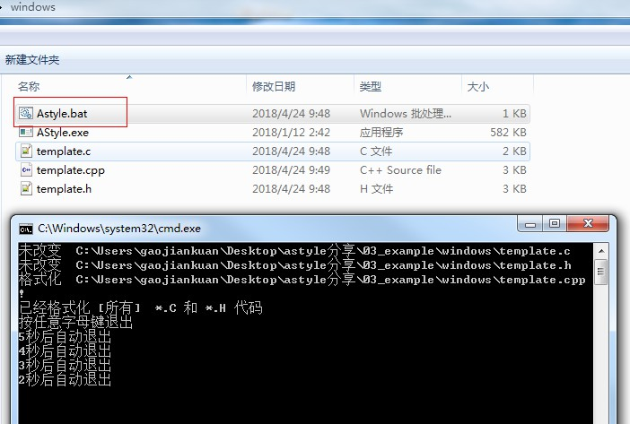
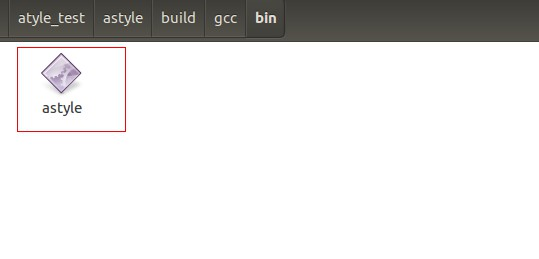
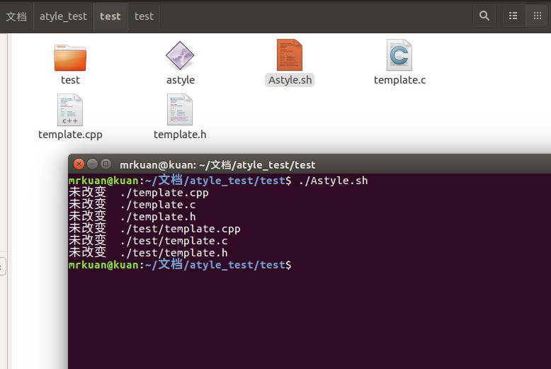

# astyle 分享使用

##  1.概述
本文档是介绍asyle 格式化代码使用，[官网地址](http://astyle.sourceforge.net/)，具体astyle配置不想写介绍，百度下都有，重点讲下如何使用，其中[asyle配置](https://github.com/RT-Thread/rt-thread/blob/master/documentation/coding_style_cn.md)来源于rtthread，可以百度下其它配置写下
```
    参数：--style=allman
          --indent=spaces=4
          --indent-preproc-block
          --pad-oper
          --pad-header
          --unpad-paren
          --suffix=none
          --align-pointer=name
          --lineend=linux
          --convert-tabs
          --verbose
````
## 2.正文

正文主要将如何使用atyle，从linux和windows两个系统下讲起

- 1.window 使用

 将 **02_source/AStyle_3.1_windows.zip** 进行解压，然后打开解压后的 **AStyle_3.1_windows\AStyle\bin\AStyle.exe** 进行复制到工程中，具体示例参考下 **03_example\windows**。



- 2.linux使用

本文linux 在Ubuntu演示。
解压下好的astyle

```
tar -xzvf astyle_3.1_linux.tar.gz
```
进入到 **astyle_3.1_linux/astyle/build/gcc** 目录 进行**make**，得到 **bin/astyle**



将得到的asyle文件拖入到工程目录中，执行 **./Astyle.sh**



## 参考

1.香龙的**代码自动格式化.bat**


